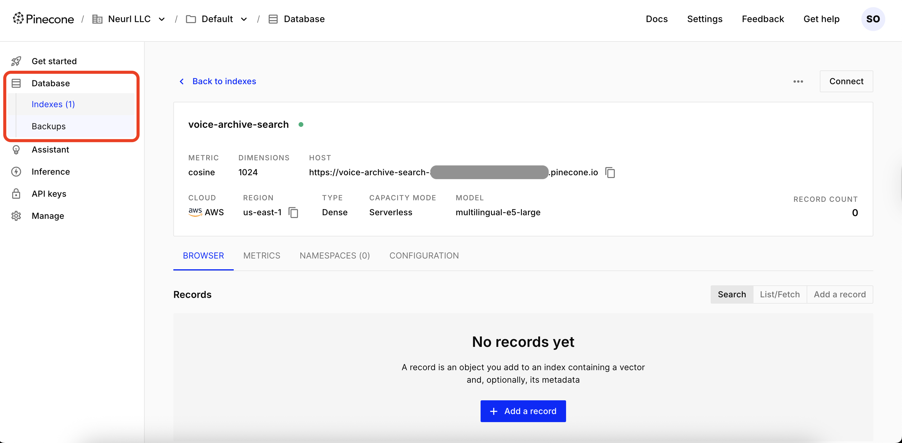

# 🎤 Voice Archive Search with Deepgram STT, Cohere Embeddings, and Pinecone Vector DB

Build a **voice archive search** tool that turns hours of calls, meetings, and interviews into a **semantically searchable** knowledge base.  
It combines **Deepgram STT** (accurate, low‑latency speech‑to‑text) with **vector embeddings** and a **vector database** for fast, intent‑based retrieval — wrapped in a lightweight **FastHTML** web UI.

👉 Turn speech into searchable data with Deepgram’s **[speech‑to‑text API](https://deepgram.com/product/speech-to-text)**.


## ✨ Features

### 🎙️ Voice Processing
- **Deepgram Nova‑3** transcription (punctuation, **diarization**, **utterances**)
- **Word‑level timestamps** → smart **segmentation** into playable chunks
- Optional **regex PII redaction** (emails, phones, SSNs, cards, IPs) **before** indexing

### 🌐 Web UI (FastHTML + HTMX + Tailwind)
- **Drag & drop** upload or **URL** ingestion (`.wav` / `.mp3`)
- **Deepgram-styled** theme & buttons
- **Persistent audio player** + “**▶ Play** from timestamp” in results
- **Search progress bar** (HTMX indicator)
- **Results render under the Search box** (no scrolling hunt)
- **Collapsible** “Processing Complete” card / optional **mini-player** (OOB swap)

### 🔍 Semantic Search
- **Cohere `embed‑v4.0`** embeddings (1024‑dim floats)
- **Pinecone** similarity search (serverless index)
- **Duplicate control**: text‑level de‑dup + **MMR** reranking for diverse results
- Threshold slider & top‑K control

### 📏 Built‑in Evaluation (optional)
- Paste **gold relevant IDs** → see **nDCG@k**, **Recall@k**, **MRR** in the UI
- Toggle **“Show result IDs”** to copy the right values

---

## 🧭 Repository layout

```
📦 deepgram-53/            # voice-archive-search repo
├── app.py                 # FastHTML web app (UI + endpoints)
├── voice_archive.py       # Core pipeline (STT → segment → redact → embed → Pinecone)
├── evaluate.py            # nDCG@k, Recall@k, MRR helpers
├── requirements.txt
├── .env                   # your API keys (not committed)
└── static/
    ├── styles.css         # Deepgram-inspired theme + progress bar
    └── deepgram-logo.svg  # Placeholder logo

```

## 🚀 Quick Start

### Prerequisites

1. **Python 3.10+** installed on your system
2. **API Keys** for the following services:
   - [Deepgram API](https://deepgram.com/) for speech-to-text (STT)
   - [Cohere API](https://cohere.ai/) for embeddings
   - [Pinecone](https://pinecone.io/) for vector DB: serverless index host

### Installation

1. **Clone and setup**:
```bash
git clone <your-repo-url>
cd deepgram-53
python3 -m venv venv
source venv/bin/activate         # Windows: venv\Scripts\activate
pip install -r requirements.txt
```

2. **Environment setup**:
Create a `.env` file in the project root:
```env
DEEPGRAM_API_KEY=your_deepgram_api_key
COHERE_API_KEY=your_cohere_api_key
PINECONE_API_KEY=your_pinecone_api_key
PINECONE_INDEX_HOST=your_pinecone_index_host   # e.g. xxx-xxxx.svc.us-west1-gcp.pinecone.io

# Optional toggles
REDACT_PII=true                 # run a small regex-based PII redactor before indexing
```

### Running the Application

1. **Start the web server**:
```bash
python app.py
```

2. **Open your browser** and navigate to:
```
http://localhost:5001
```

## 🎯 How to Use

### 📁 Upload Audio Files

1. **Drag and drop** an MP3 or WAV file onto the upload area, or **click to browse**
2. The file will automatically start processing
3. Watch the spinner; when done, a Processing Complete card appears.
4. View the **completed transcript** in the expandable section
5. Your audio is now **searchable** in the archive!

### 🔗 Process Audio from URLs

1. **Paste a URL** to an MP3 or WAV file in the URL input field
2. Click **"Process URL"** to download and transcribe
3. The same processing pipeline applies as file uploads

### 🔍 Search Your Archives

1. **Enter your natural‑language query** in the search box (e.g., “refund escalation”, "customer support teams", “GPU architecture”).
2. **Adjust settings**:
   - **Results**: Choose 5, 10, or 20 results
   - **Similarity threshold**: Use the slider (0.0 to 1.0)
3. Click **"Search Archives"** to find relevant segments → a progress bar shows while searching.
4. **Review results** immediately under the Search box, each with:
- Similarity score
- Timestamps + speaker label
- Transcript snippet
- ▶ Play jumps the player to the segment start

### 📏 Evaluate (optional)
1. Expand “📏 Evaluation (optional)” in the search form.
2. Enable “Show result IDs” and run a search to reveal id: ... per card.
3. Copy the relevant IDs into the textarea (one per line or comma‑separated).
4. Search again → a 📊 Evaluation card shows nDCG@k, Recall@k, and MRR above results.


## 🏗️ Architecture

### Processing Pipeline

```mermaid
graph TD
    A[Audio Input (wav, mp3)] --> B[Deepgram STT (Nova‑3)]
    B --> C[Word timestamps + diarization]
    C --> D[Segmentation (pauses, speaker turns, max duration)]
    D --> E[PII Redaction (regex) - optional]
    E --> F[Cohere Embeddings (embed-v4)]
    F --> G[Pinecone Upsert (text + timestamps + speaker + file + session)]
    G --> H[Searchable Vector Archive]

    Q[User Query] --> QE[Query Embedding]
    QE --> R[Pinecone Query (fetch K)]
    R --> MMR[De‑dupe + MMR Rerank]
    MMR --> SR[Top‑K Diverse Results]
```

### Technology Stack

- **FastHTML**: Modern Python web framework
- **HTMX**: Dynamic web interactions without JavaScript
- **Tailwind CSS**: Utility-first CSS framework
- **Deepgram**: Advanced speech-to-text API
- **Cohere**: State-of-the-art embedding models
- **Pinecone**: Vector database for similarity search

## 🔧 Configuration and Tuning Options

### Audio Processing/STT
- **Model**: Nova-3 (Deepgram's latest)
- **Speaker detection (Diarization)**: enabled (`diarize=true`)
- **Utterances**: enabled
- **Segmentation**: greedy by silence gap (`max_gap`), speaker change, and max duration
- **MIME detection**: best‑effort for .wav / .mp3 when sending to Deepgram and when serving audio
- **Noise suppression**: Enabled by default
- **Format**: Smart formatting for readable output

### Search/Ranking Settings
- **Embedding model**: `embed-v4.0` (`1024` dimensions)
- **Search namespace**: "voice-archives" 
- **Default results**: 10
- **Default threshold**: 0.7
- **Index**: Pinecone (serverless); metadata includes `text`, `start`, `end`, `speaker`, `file`, `session`
- **Duplicates**: optional text‑level de‑dup per file + MMR rerank

## Privacy
- `REDACT_PII=true` runs a basic regex pass (emails, phones, SSNs, cards, IPv4).

⚠️ It’s intentionally simple — for regulated workloads, use a dedicated PII service/library.


### Performance
- **Concurrent processing**: Up to 5 workers for batch operations
- **File cleanup**: Automatic temporary file removal
- **Session management**: In-memory (session-only persistence)

## 🔧 CLI usage (optional)

### Using the Core Module

You can also use the core `voice_archive.py` module directly with a quick end‑to‑end test from the terminal:

```python
from voice_archive import run_pipeline

# Process multiple files and search
audio_files = ['meeting1.mp3', 'interview.mp3']
run_pipeline(audio_files, 'project discussion')
```

This will:

- Transcribe & segment each file
- (Optionally) redact
- Embed & upsert into Pinecone
- Run a sample query and print the top matches


### Batch Processing

For large-scale processing, use the batch functions:

```python
from voice_archive import batch_transcribe

audio_paths = ['file1.mp3', 'file2.mp3', 'file3.mp3']
transcripts = batch_transcribe(audio_paths, max_workers=3)
```

### Custom Embeddings

Generate embeddings for your own text:

```python
from voice_archive import generate_embeddings

texts = ['Hello world', 'Machine learning', 'Voice recognition']
embeddings = generate_embeddings(texts)
```

## 🧩 Tips & FAQs

Q: I see duplicate‑looking results.
A: That’s common if you re‑upload the same file (each run has a new `session_id`).
Mitigations included:
- Text de‑dup (per file) at query time
- MMR reranking for diversity

For a long‑term clean index, consider stable vector IDs (e.g., `file_hash:i`) so re‑ingests overwrite prior vectors.

Q: The ▶ Play buttons sometimes don’t play.
A: The audio player is kept in a separate container so search updates don’t remove it.
If you refreshed the page after upload, the in‑memory session might be gone. Re‑upload, then search.

Q: The search indicator doesn’t show.
A: Ensure `/static/styles.css` loads (DevTools → Network = 200). The indicator is the element with id="search-indicator"; HTMX toggles it during `/search`.

Q: Where do I get Pinecone “index host”?
A: From your Pinecone serverless index settings (looks like `xxxx-xxxxx.svc.us-west1-gcp.pinecone.io`).



---

## 🔍 Troubleshooting

### Common Issues

**"No file provided" error**:
- Ensure you're uploading a valid MP3 or WAV file
- Check file size limits (depends on your system)

**"API key not found" errors**:
- Verify your `.env` file exists and contains all required keys
- Restart the application after updating environment variables

**Search returns no results**:
- Try lowering the similarity threshold
- Use different search terms
- Ensure you've processed at least one audio file

**Slow transcription**:
- Large files take more time to process
- Check your internet connection for API calls
- Consider upgrading your Deepgram plan for faster processing

### Performance Tips

1. **File optimization**: Use compressed MP3 files for faster uploads, or WAV files for better audio quality
2. **Search strategy**: Start with broader queries, then refine
3. **Threshold tuning**: Lower thresholds (0.5-0.6) for broader results
4. **Batch processing**: Process multiple files together for efficiency

## 📊 API Reference

### FastHTML Routes

- `GET /` - Main application interface
- `POST /upload-file` - Handle file uploads
- `POST /process-url` - Process audio from URLs  
- `POST /search` - Search voice archives

### Core Functions

- `transcribe_file_with_enhancements()` - Transcribe with speaker diarization
- `generate_embeddings()` - Create vector embeddings
- `upsert_embeddings()` - Store vectors in Pinecone
- `query_index()` - Search vector database

## 📄 License & attribution
This example is provided for educational use only.
- Deepgram, Pinecone, Cohere are trademarks of their respective owners.
- Please verify brand colors/fonts with your design/brand teams if you customize the theme.

## 🙌 Credits
- UI & pipeline scaffolding by Neurl Creators (@Silas-Asamoah and @NonMundaneDev)
- Many UX touches inspired by Deepgram styling
