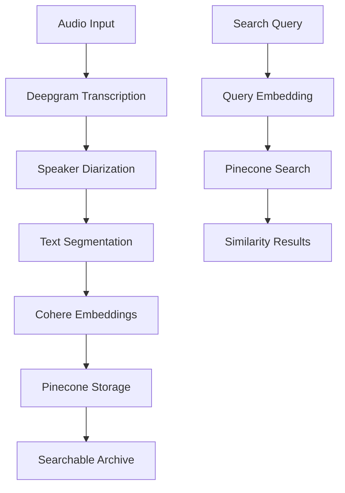

# 🎤 Voice Archive Search with Deepgram

Build a powerful voice archive search tool by combining Deepgram's speech-to-text API with vector embeddings for semantic search, with a web interface built with FastHTML!

## ✨ Features

### 🎙️ Voice Processing
- **Real-time transcription** using Deepgram's Nova-3 model
- **Speaker diarization** to identify different speakers
- **Noise suppression** for better audio quality
- **Smart formatting** for readable transcripts

### 🌐 Web Interface
- **Drag-and-drop file upload** for .mp3 and .wav files
- **URL processing** for remote audio files
- **Real-time progress indicators** during processing
- **Modern, responsive design** with Tailwind CSS

### 🔍 Semantic Search
- **Vector embeddings** using Cohere's embed-v4.0 model
- **Pinecone integration** for fast similarity search
- **Similarity threshold controls** for refined results
- **Configurable result limits** (5, 10, or 20 results)


## 🚀 Quick Start

### Prerequisites

1. **Python 3.10+** installed on your system
2. **API Keys** for the following services:
   - [Deepgram API](https://deepgram.com/) for speech-to-text
   - [Cohere API](https://cohere.ai/) for embeddings
   - [Pinecone](https://pinecone.io/) for vector storage

### Installation

1. **Clone and setup**:
```bash
git clone <your-repo-url>
cd deepgram-53
```

2. **Create virtual environment**:
```bash
python3 -m venv venv
source venv/bin/activate  # On Windows: venv\Scripts\activate
```

3. **Install dependencies**:
```bash
pip install -r requirements.txt
```

4. **Environment setup**:
Create a `.env` file in the project root:
```env
DEEPGRAM_API_KEY=your_deepgram_api_key_here
COHERE_API_KEY=your_cohere_api_key_here
PINECONE_API_KEY=your_pinecone_api_key_here
PINECONE_INDEX_HOST=your_pinecone_index_host_here
```

### Running the Application

1. **Start the web server**:
```bash
python app.py
```

2. **Open your browser** and navigate to:
```
http://localhost:5001
```

## 🎯 How to Use

### 📁 Upload Audio Files

1. **Drag and drop** an MP3 or WAV file onto the upload area, or **click to browse**
2. The file will automatically start processing
3. Watch the **real-time progress** as your audio is transcribed
4. View the **completed transcript** in the expandable section
5. Your audio is now **searchable** in the archive!

### 🔗 Process Audio from URLs

1. **Paste a URL** to an MP3 or WAV file in the URL input field
2. Click **"Process URL"** to download and transcribe
3. The same processing pipeline applies as file uploads

### 🔍 Search Your Archives

1. **Enter your search query** in the search box
2. **Adjust settings**:
   - **Results**: Choose 5, 10, or 20 results
   - **Similarity threshold**: Use the slider (0.0 to 1.0)
3. Click **"Search Archives"** to find relevant segments
4. **Review results** with similarity scores and transcript snippets

## 🏗️ Architecture

### Core Components

```
📦 Voice Archive System
├── 🎙️ voice_archive.py      # Core transcription & embedding logic
├── 🌐 app.py               # FastHTML web interface
```

### Processing Pipeline



### Technology Stack

- **FastHTML**: Modern Python web framework
- **HTMX**: Dynamic web interactions without JavaScript
- **Tailwind CSS**: Utility-first CSS framework
- **Deepgram**: Advanced speech-to-text API
- **Cohere**: State-of-the-art embedding models
- **Pinecone**: Vector database for similarity search

## 🔧 Configuration Options

### Audio Processing
- **Model**: Nova-3 (Deepgram's latest)
- **Speaker detection**: Automatic with configurable speaker count
- **Noise suppression**: Enabled by default
- **Format**: Smart formatting for readable output

### Search Settings
- **Embedding model**: embed-v4.0 (1024 dimensions)
- **Search namespace**: "voice-archives" 
- **Default results**: 10
- **Default threshold**: 0.7

### Performance
- **Concurrent processing**: Up to 5 workers for batch operations
- **File cleanup**: Automatic temporary file removal
- **Session management**: In-memory (session-only persistence)

## 🛠️ Advanced Usage

### Using the Core Module

You can also use the core `voice_archive.py` module directly:

```python
from voice_archive import run_pipeline

# Process multiple files and search
audio_files = ['meeting1.mp3', 'interview.mp3']
run_pipeline(audio_files, 'project discussion')
```

### Batch Processing

For large-scale processing, use the batch functions:

```python
from voice_archive import batch_transcribe

audio_paths = ['file1.mp3', 'file2.mp3', 'file3.mp3']
transcripts = batch_transcribe(audio_paths, max_workers=3)
```

### Custom Embeddings

Generate embeddings for your own text:

```python
from voice_archive import generate_embeddings

texts = ['Hello world', 'Machine learning', 'Voice recognition']
embeddings = generate_embeddings(texts)
```

## 🔍 Troubleshooting

### Common Issues

**"No file provided" error**:
- Ensure you're uploading a valid MP3 or WAV file
- Check file size limits (depends on your system)

**"API key not found" errors**:
- Verify your `.env` file exists and contains all required keys
- Restart the application after updating environment variables

**Search returns no results**:
- Try lowering the similarity threshold
- Use different search terms
- Ensure you've processed at least one audio file

**Slow transcription**:
- Large files take more time to process
- Check your internet connection for API calls
- Consider upgrading your Deepgram plan for faster processing

### Performance Tips

1. **File optimization**: Use compressed MP3 files for faster uploads, or WAV files for better audio quality
2. **Search strategy**: Start with broader queries, then refine
3. **Threshold tuning**: Lower thresholds (0.5-0.6) for broader results
4. **Batch processing**: Process multiple files together for efficiency

## 📊 API Reference

### FastHTML Routes

- `GET /` - Main application interface
- `POST /upload-file` - Handle file uploads
- `POST /process-url` - Process audio from URLs  
- `POST /search` - Search voice archives

### Core Functions

- `transcribe_file_with_enhancements()` - Transcribe with speaker diarization
- `generate_embeddings()` - Create vector embeddings
- `upsert_embeddings()` - Store vectors in Pinecone
- `query_index()` - Search vector database
